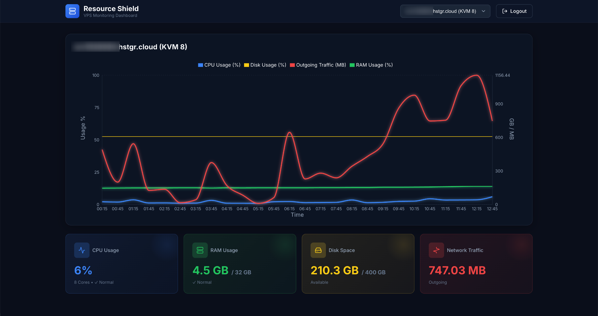

# Hostinger Resource Shield 🛡️

**Hostinger Resource Shield** is a robust, open-source monitoring solution designed specifically for Hostinger VPS users. It provides specific time-based health checks, real-time resource visualization, and intelligent alerting to help you stay on top of your server's performance.



## 🚀 Key Features

*   **📊 Interactive Dashboard**: Visualize CPU, RAM, and Disk usage with beautiful, responsive charts (powered by Recharts).
*   **⏰ Flexible Scheduling**: Configure health checks to run at specific minutes of the hour (e.g., `15,45`) or at regular intervals.
*   **🚨 Smart Alerting**: Detects resource "spikes" within your configured check interval. Sends email alerts only when thresholds are breached.
*   **🌍 Timezone Aware**: All logs, charts, and alerts respect your local timezone (e.g., `Asia/Kolkata`), ensuring you see exactly *when* issues occurred.
*   **⚙️ Granular Control**: Set global resource thresholds or override them for specific VPS instances (e.g., `CPU_THRESHOLD_1030000`).
*   **🐳 Docker Ready**: Deployment is a breeze with Docker and Docker Compose.

## 🛠️ Tech Stack

*   **Frontend**: React (Vite), TailwindCSS, Recharts.
*   **Backend**: Node.js, Express.
*   **Data Source**: Hostinger VPS API.
*   **Containerization**: Docker, Docker Compose (Alpine-based images).

## 📋 Prerequisites

*   Docker & Docker Compose installed on your machine.
*   A Hostinger account with VPS services.
*   A Hostinger API Token.

## 🚀 Getting Started

### 1. Clone the Repository

```bash
git clone https://github.com/MrUjjwalG/hostinger_resource_sheild.git
cd hostinger_resource_sheild
```

### 2. Configure Environment Variables

Create a `.env` file in the root directory. You can use the example below as a template:

```properties
# Server Configuration
PORT=5000
TZ=Asia/Kolkata  # Your Timezone

# Admin Authentication (for Dashboard)
ADMIN_USER=admin
ADMIN_PASS=securepassword123
JWT_SECRET=your_super_secret_jwt_key

# Hostinger API Configuration
HOSTINGER_API_TOKEN=your_hostinger_api_token
VPS_ID=1030000,778406  # Comma-separated list of VPS IDs to monitor

# Alerting Configuration (Email)
SMTP_HOST=smtp.gmail.com
SMTP_PORT=587
SMTP_USER=your_email@gmail.com
SMTP_PASS=your_app_specific_password
ALERT_EMAIL=admin@example.com

# Resource Thresholds (Global)
CPU_THRESHOLD=80      # Percentage
RAM_THRESHOLD=80      # Percentage
DISK_THRESHOLD=85     # Percentage

# Per-VPS Threshold Overrides (Optional)
# Format: <TYPE>_THRESHOLD_<VPS_ID>
# CPU_THRESHOLD_1030000=10 

# Monitoring Schedule
# Monitor specific minutes of the hour (e.g., check at xx:27 and xx:46)
CHECK_INTERVAL_MINUTES=27,46
```

### 3. Run with Docker

Build and start the container:

```bash
docker-compose up --build -d
```

Your application will be accessible at: `http://localhost:5000` (or the port defined in docker-compose).

## 🔧 Configuration Guide

### Scheduling Checks (`CHECK_INTERVAL_MINUTES`)
*   **Specific Minutes**: Set to `15,45` to run checks at xx:15 and xx:45 of every hour.
*   **Interval**: Set to `15` to run checks every 15 minutes (at 0, 15, 30, 45).
*   **Hourly**: Set to `60` to run strictly at the top of the hour.

The system automatically calculates the "lookback window" based on your schedule to ensure no data is missed between checks.

### Per-VPS Thresholds
You can override global thresholds for critical servers. For a VPS with ID `123456`, add these to your `.env`:
*   `CPU_THRESHOLD_123456=50`
*   `RAM_THRESHOLD_123456=90`

## 🖥️ API Reference

The backend provides a few endpoints used by the dashboard:

*   `GET /api/config`: Returns public configuration (like check interval).
*   `GET /api/metrics`: Fetches formatted metrics for the dashboard.
*   `POST /auth/login`: Admin login.

## 🤝 Contributing

Contributions are welcome! Please feel free to submit a Pull Request.

1.  Fork the project.
2.  Create your feature branch (`git checkout -b feature/AmazingFeature`).
3.  Commit your changes (`git commit -m 'Add some AmazingFeature'`).
4.  Push to the branch (`git push origin feature/AmazingFeature`).
5.  Open a Pull Request.

## 📄 License

This project is licensed under the MIT License - see the [LICENSE](LICENSE) file for details.

---

Made with ❤️ by [MrUjjwalG](https://github.com/MrUjjwalG)
